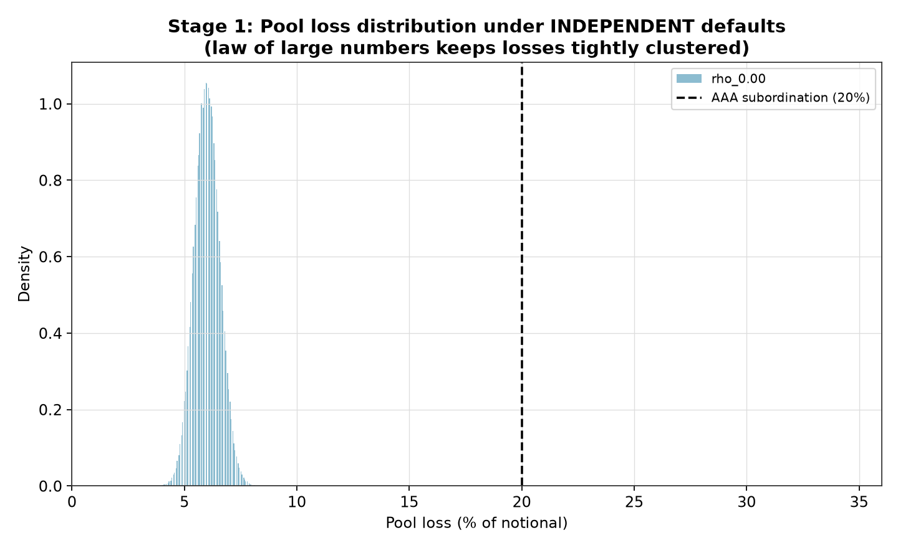
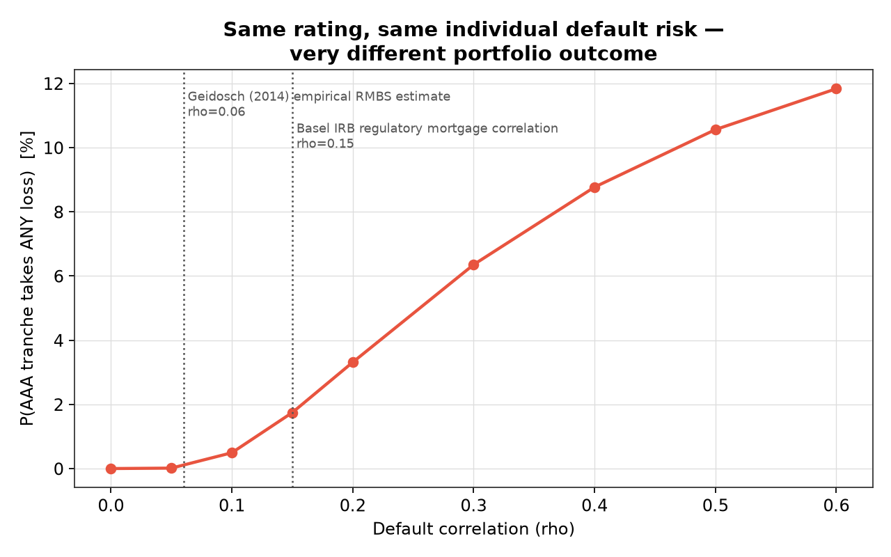
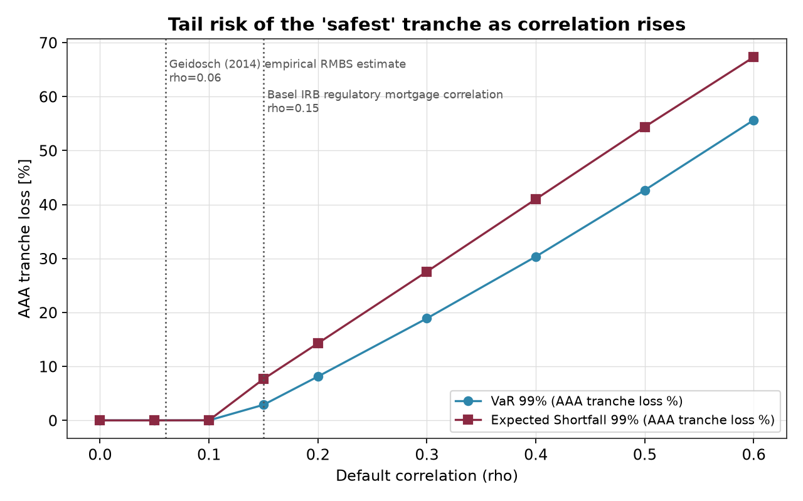
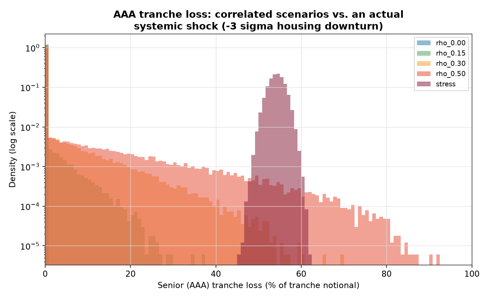

# Rated Safe, Priced Blind: A Monte Carlo Test of Credit Rating Agency Fragility

**Does "AAA" mean safe — or does it just mean "we didn't model the correlation"?**

This project is a numerical test of an argument Nassim Taleb makes in his opera magna *Antifragile*: credit rating agencies are structurally disconnected from the consequences of their own judgments. They are paid to issue opinions on securities they never have to hold, using models that can look correct ex-ante for years and then fail catastrophically all at once (following a black swan). This was a point made to ashame players without skin in the game for the (then recent) 2008 crisis, precisely because in this type of environments, one would be taken out by a single catastrophic event (before receiving a government bailout).

This project builds a *synthetic* mortgage pool, tranches it the way a 2006-07 subprime CDO was structured, and runs it through several Monte Carlo engines of increasing realism to show *mechanically* how a handful of hidden assumptions (independence, correlation, and how loss severity behaves in a crisis) turn a "virtually risk-free" AAA-rated tranche into one exposed to serious tail risk, without changing a single loan's individual credit quality or its rating.

> **A note on what's actually running where**: every number in the *Key Results* section below (Stage 1, the Stage 2 sweep, the Black Swan stress test, and the calibration section) comes from both a single-factor **Gaussian** copula and correlation (`simulate_correlated_defaults` in `src/simulate.py`) **and** a **t-copula** result using the Student-t distribution (fatter-tailed).

---

## The argument, made numerically

Rating agencies rate the *marginal* default probability of a security. A CDO tranche rated AAA in 2006 was rated on the assumption that the loans backing it wouldn't all go bad at once, and that a loan's expected loss-given-default was roughly constant. Both assumptions turned out to be wrong in the same direction at the same time.

1. **Stage 1 — independent defaults.** If loan defaults are independent, a diversified pool's total losses cluster tightly around their average (law of large numbers). A senior tranche protected by a subordination cushion is, correctly, almost never touched. This is the world the AAA rating implicitly describes. Checking against a coupon-based return calculation, senior AAA capital is fully protected while equity is essentially guaranteed to be wiped out, exactly matching why equity carried a much higher coupon.
2. **Stage 2 — correlated defaults, single-factor Gaussian copula with procyclical severity.** The *same* pool, with the *same* marginal default probability per loan (i.e. the same individual rating), is re-run through a single-factor copula where every loan shares exposure to one systemic factor (a regional housing downturn), and where loss-given-default is allowed to worsen in the same adverse states that drive up correlated defaults.
3. **Robustness check: genuine tail dependence via a t-copula.** A Gaussian copula has **zero asymptotic tail dependence**: no matter how high correlation is set, extreme systemic and idiosyncratic shocks become *less* likely to coincide in the far tail, which is the opposite of how real defaults clustered in 2007-09. A **Student-t copula** fixes this. Run at the same correlation, it shows meaningfully more tail risk than the Gaussian engine above (see the comparison table below).
4. **Bonus stress test.** Conditioning the systemic factor on an explicit −3σ realization (an actual regional housing crash) shows the AAA tranche's expected loss reaching ~54% of its notional, with a 100% probability of a negative net return once its coupon income is netted against realized losses. A t-copula variant of the same shock shows a lower average loss (~20%) and is no longer a certain loss (85% vs. 100% probability of any loss). See the stress test section.
5. **Calibration.** The correlation parameter (and only the correlation parameter, see caveat below) is checked against two independent real-world reference points (visible in the graphs) and against a market-implied correlation backed out of actual ABX.HE index prices, instead of assuming one.

There is, then, a gap between what the rating certifies and what the portfolio can actually lose once correlation, tail dependence, and procyclical severity are taken into account. This is what Taleb described and what we, then, expected. The rating agency's model was internally consistent and its output (AAA) was "correct" under its own assumptions. It failed because nobody paid a cost for choosing the assumption that happened to be wrong: the agencies never held the securities they rated.

**Scope note:** this project demonstrates a *technical / model-risk* failure. Taleb's fuller argument about rating agencies is really about *incentives* (issuer-pays fees, ratings shopping, no personal liability for being wrong), which this simulation does not model directly. The two arguments are related but distinct; see *Possible extensions* below.

## Key results (this run)

**Stage 1 — independent defaults** (1,000 loans, 10% marginal default probability, 60% base LGD, 200,000 trials):

| Scenario | Mean loss % | P(any loss) % | VaR 99% | ES 99% | Coupon % | Mean net return % | P(negative return) % |
|---|---|---|---|---|---|---|---|
| Pool (whole) | 6.00 | 100.00 | 7.38 | 7.56 | – | – | – |
| Equity tranche | 99.84 | 100.00 | 100.00 | 100.00 | 18.0 | **−81.84** | 100.00 |
| Mezzanine tranche | 6.72 | 96.18 | 15.87 | 17.04 | 9.0 | 2.28 | 27.76 |
| Senior (AAA) tranche | 0.00 | 0.00 | 0.00 | 0.00 | 6.0 | 6.00 | 0.00 |

> **Net-return caveat, right here rather than buried in Limitations:** net return = full nominal coupon minus principal lost, non-compounded, no discounting, and no reduction in coupon for a tranche that's partially written down mid-period. Equity's −81.84% in particular should be read as "this tranche's coupon was nowhere close to covering its losses," not as a precise cash-flow-accurate return number — a real deal would earn coupon only on outstanding (not original) balance and would amortize over time.



**Stage 2 — correlated defaults, Gaussian copula with procyclical severity**
(same pool, same 10% marginal default probability, 200,000 trials per ρ):

| ρ | AAA P(any loss) % | AAA VaR 99% | AAA ES 99% | Pool VaR 99% | AAA mean net return % | AAA P(negative return) % |
|---|---|---|---|---|---|---|
| 0.00 | 0.000 | 0.00 | 0.00 | 7.38 | 6.000 | 0.000 |
| 0.05 | 0.014 | 0.00 | 0.00 | 13.63 | 6.000 | 0.001 |
| 0.10 | 0.493 | 0.00 | 0.02 | 18.10 | 5.984 | 0.085 |
| 0.15 | 1.745 | 2.88 | 7.66 | 22.31 | 5.913 | 0.530 |
| 0.20 | 3.313 | 8.12 | 14.28 | 26.50 | 5.781 | 1.395 |
| 0.30 | 6.354 | 18.90 | 27.57 | 35.12 | 5.359 | 3.600 |
| 0.40 | 8.769 | 30.35 | 40.99 | 44.28 | 4.780 | 5.863 |
| 0.50 | 10.561 | 42.66 | 54.39 | 54.13 | 4.083 | 7.755 |
| 0.60 | 11.834 | 55.65 | 67.32 | 64.52 | 3.277 | 9.267 |

No individual loan's default probability changed anywhere in this table. A rating based purely on marginal default probability would have been identical at every row, only the correlation/severity assumption changed.

> **Precision caveat:** the smallest probabilities in this table are close to the edge of what 200,000 trials can resolve. `P(any loss) = 0.014%` at ρ = 0.05 corresponds to roughly 28 simulated occurrences; the relative Monte Carlo standard error on a count that small is approximately `1/sqrt(28) ≈ 19%`, i.e. the true value is plausibly anywhere in roughly [0.011%, 0.017%]. Treat the third and fourth significant figures in this row (and the ρ=0.10 row) as indicative, not exact; the qualitative story (rising sharply and monotonically with ρ) is robust; the specific decimals at the smallest probabilities are not.




### Robustness check: adding genuine tail dependence (t-copula)

The table above uses a Gaussian copula, which (as noted) by definition understates how often extreme events cluster. Re-running the *same* correlation values through a single-factor **Student-t copula** (4 degrees of freedom), with severity held at a flat 60% LGD in both cases so the comparison isolates tail dependence alone, gives a materially fatter tail at identical ρ:

| ρ | Gaussian P(AAA loss>0) % | t-copula P(AAA loss>0) % | Gaussian ES 99% | t-copula ES 99% |
|---|---|---|---|---|
| 0.15 | 1.177 | **4.816** | 4.64 | **16.93** |
| 0.30 | 4.712 | **7.352** | 18.65 | **27.92** |
| 0.50 | 8.448 | **9.582** | 34.42 | **39.81** |

At ρ = 0.15 (close to the Basel benchmark discussed below) moving from a Gaussian to a t-copula roughly **quadruples** the AAA tranche's loss probability and more than **triples** its Expected Shortfall, using the exact same correlation assumption. This is a strong evidence that correlation level alone isn't the full story: the *shape* of the dependence structure matters just as much, and the model family regulators and agencies actually used (Gaussian) was the wrong shape in a way that cuts entirely in one direction (always understating tail risk, never overstating it).

## Bonus: Black Swan stress test

Conditioning the systemic factor at ρ = 0.30 on an explicit −3σ realization simulating a crisis, both variants with procyclical severity:

| Metric | Gaussian | t-copula |
|---|---|---|
| Mean loss | 54.2% | 45% |
| P(any loss) | 100% | 94.1% |
| VaR 99% | 58.2% | **85.4%** |
| ES 99% | 58.8% | **86.9%** |
| Mean net return | **−48.2%** | -39% |
| P(negative return) | 100% | 91% |

The t-copula's average outcome is actually slightly milder (94% vs. 100% chance of any loss, lower mean loss), but its tail is dramatically worse: VaR and ES both jump to roughly 85-87%, nearly wiping the tranche out, versus ~58% under the Gaussian engine. That's the t-copula's shared chi-square scaling factor at work: most of the time it mutes the fixed shock slightly, but occasionally it compounds it far past what a fixed −3σ draw alone can produce under Gaussian assumptions.c

> **Check on "−3σ":** national U.S. home prices (S&P/Case-Shiller) fell roughly 27-30% peak-to-trough between 2006 and 2012 (deepest national decline recorded). This project has **not** rigorously converted that peak-to-trough decline into a precise number of standard deviations of historical annual house-price-return volatility, so "−3σ" here should be read as "a severe, multi-year-decline-sized shock," not as a number backed by its own volatility estimate. That conversion is listed under *Possible extensions*.



## Calibration against real-world reference points

> **Scope of this section:** only the correlation parameter (ρ) is checked against external data here. Severity sensitivity, the −3σ shock size, tranche subordination, and coupon rates remain illustrative assumptions, not independently calibrated; see *Limitations* below.

| Reference | ρ | Model's P(AAA loss > 0) |
|---|---|---|
| Geidosch (2014) empirical RMBS estimate | 0.06 | 0.048% |
| Basel IRB regulatory mortgage correlation | 0.15 | 1.745% |

| ABX.HE AAA price point | Price | Implied loss | Implied ρ (Gaussian engine) |
|---|---|---|---|
| 2007-02-23 (06-2) | 99.15 | 0.8% | **0.134** |
| 2007-12-31 (06-2) | 87.00 | 13.0% | unreachable by ρ alone, even at 0.95 |
| 2008-12-02 (07-2) | 30.34 | 69.7% | unreachable by ρ alone, even at 0.95 |

The early-2007 point backs out an implied correlation (0.134) reasonably close to Basel's regulatory assumption (0.15) (market and regulation aligned). The later two points are **structurally unreachable by correlation alone under this engine**: a single-factor copula's tail loss probability is capped near the pool's marginal default probability itself, no matter how high we defined the correlation in our model it was mathematically impossible to reproduce those higher loss numbers. 
Therefore, matching what the market was actually pricing in by late 2007 and 2008 requires **also** raising the marginal default probability (the evidence here points to agencies having underpriced *individual* mortgage default risk, not just correlation). These data are still under the Gaussian paradigm (including the ρ=0.134 above).

## Historical grounding (what's real vs. stylized)

This is **not** a reconstruction of any specific real CDO (loan and tranche data from 2006–07 is not public). Rather, it is a stylized model, with several of its parameters checked against public sources:

- AAA tranche subordination (~20%) sits within the ~20–30% range reported for subprime CDOs across several post-crisis studies (Coval, Jurek & Stafford; the FCIC Barnett-Hart's empirical CDO study).
- The FCIC found that **over 80% of Moody's Aaa-rated CDO tranches from 2006** were eventually downgraded to junk.
- The correlation parameter is checked against Basel's flat 15% regulatory asset correlation for retail residential mortgages, and against Geidosch's (2014) empirical estimate of ~6% realized U.S. RMBS asset correlation.
- National house prices (S&P/Case-Shiller) fell roughly 27-30% peak-to-trough from 2006 to 2012, the deepest national decline recorded (which is what the −3σ Black Swan stress test is gesturing at, without being an exact replica but a model, as the disclaimer above says).
- The single-factor Gaussian copula is a simplified version of the same model family (the "Li model") actually used to price and rate CDO tranches pre-crisis; the t-copula robustness check demonstrates why that choice of family mattered, not just the correlation level within it.
- A handful of ABX.HE AAA CDS index price points (Markit data, as reported in BIS/RBA/industry write-ups) are used to back out a market-implied correlation via the same "base correlation" logic used in practice, with an explicit caveat that price-to-loss conversion here is a rough, order-of-magnitude approximation (it ignores risk premia, liquidity effects, and the CDS-vs-cash-bond distinction).

The point of the project isn't to reproduce a specific number to the decimal, but rather to show that this failure mode is a *structural property of the model class*, checkable against public data, and reproducible with a few hundred lines of code.

## Repository structure

```
credit-rating-fragility/
├── README.md
├── requirements.txt
├── src/
│   ├── pool.py         # loan pool parameters, tranche waterfall, coupons, 
│   │                    # and real-world calibration benchmarks (Basel,
│   │                    # Geidosch, ABX.HE price history)
│   ├── simulate.py     # Stage 1 (independent), Stage 2 Gaussian copula,
│   │                    # Stage 2 single-factor t-copula, Black Swan stress
│   ├── metrics.py      # VaR, Expected Shortfall, P(loss), coupon-based
│   │                    # net return, ABX price->implied-loss conversion,
│   │                    # implied-correlation solver
│   └── plotting.py     # shared chart styling, log-scale tail histograms,
│                        # rho-sweep charts with real-world benchmark overlays
├── run_stage1_independent.py   # Stage 1: run + print + plot
├── run_stage2_correlated.py    # Stage 2 (Gaussian engine) + correlation
│                                 # sweep + Black Swan stress test +
│                                 # real-world calibration report
├── run_all.py                  # runs both stages end-to-end
└── results/
    ├── figures/                 # generated PNGs
    ├── stage1_summary.csv
    └── stage2_correlation_sweep.csv
```

## How to reproduce

```bash
pip install -r requirements.txt
python run_all.py
```

This regenerates every figure and CSV in `results/` from scratch (~30-60 seconds, 200,000 Monte Carlo trials per scenario). The Black Swan stress test similarly reports both a Gaussian (stressed_systemic_shock) and t-copula (stressed_systemic_shock_tcopula) variant automatically.

## Model details

- **Pool**: 1,000 loans, each with a 10% marginal probability of default over the deal's life and a 60% base loss given default (40% recovery).
- **Tranches** (% of pool notional): Equity 0–5% (18% coupon), Mezzanine 5–20% (9% coupon), Senior/AAA 20–100% (6% coupon). Loss allocation is a simplified **static waterfall**: losses hit the capital structure by seniority, without modeling cash-flow timing, prepayment, or interest diversion via OC/IC triggers.
- **Net return** = coupon income − principal lost to default. This keeps it simple, non-compounded, and without discounting; counted for each tranche.
- **Stage 1 (independent)**: each loan defaults i.i.d. Bernoulli(p).
- **Stage 2 (Gaussian)**: the engine behind every number in *Key Results*, the stress test, and the calibration section: single-factor Gaussian copula, `Z_i = sqrt(rho_eff)*M + sqrt(1-rho_eff)*eps_i`, where `rho_eff = rho + rho_sensitivity * max(0,-M)` and effective LGD = `lgd + (lgd_sensitivity * rho_eff) * max(0,-M)`. Scaling both channels by `rho_eff` keeps them off when `rho=0`, so the independent baseline stays a genuinely independent baseline.
- **Stage 2 (single-factor t-copula)**: the engine behind the Robustness check table and the t-copula row of the Black Swan stress test: same latent-factor construction, divided by a shared chi-square shock (nu degrees of freedom) to induce tail dependence, with the same optional procyclical severity mechanism as the Gaussian engine.
- **"Black Swan" stress test**: conditions the systemic factor on an explicit −3σ realization. Two variants, both with the same procyclical severity assumption: a Gaussian version (stressed_systemic_shock) and a t-copula version (stressed_systemic_shock_tcopula, where the shared chi-square scaling factor is still drawn randomly each trial).
- **Calibration**: `implied_rho_for_target_loss()` solves (via root-finding) for the correlation that reproduces a target AAA loss probability under the Gaussian engine — the same logic used to back out implied/base correlation from observed tranche prices.

## Limitations & caveats

- Only the correlation parameter is calibrated against external data. `lgd_sensitivity`, `rho_sensitivity`, the −3σ shock magnitude, tranche subordination, and coupon rates are illustrative assumptions, chosen to sit within reported historical ranges where such ranges exist, but not independently fit to data. Please note that this was an individual project intended to prove Taleb's initial point, not a PhD thesis.
- This is a **static, single-period** loss model. Real CDOs had cash-flow waterfalls, reinvestment periods, and ratings that evolved over time. Junior tranche coupons in reality could be diverted to protect senior principal under OC/IC triggers. This means that this model's junior-tranche returns are likely optimistic in stress scenarios.
- The loan pool is **homogeneous** (identical default probability and LGD per loan), while real pools were not. Additionally, a single national factor is a simplification of what was likely a regional+national factor structure.
- Subordination (20%) is treated as a fixed, given design choice. In reality, structurers optimized subordination down to the minimum level that still cleared a given rating agency's model, which is something counting on game theory and Goodhart's-Law-style processes that this project does not model explicitly.

## Possible extensions

- Calibrate `lgd_sensitivity`, `rho_sensitivity`, the −3σ shock magnitude, tranche subordination, and coupon rates against historical / academical reports wherever they exist.
- Rigorously convert the 2006-2012 national HPI peak-to-trough decline into a volatility-adjusted sigma multiple for the stress scenario, instead of asserting −3σ illustratively.
- Add Monte Carlo confidence intervals throughout, not just as a one-off caveat on the smallest probabilities.
- Extend to CDO-squared (a CDO of CDO tranches), which historically amplified the same correlation/tail-dependence blind spot further.
- Replace the ABX price-to-loss approximation with a proper CDS pricing model that accounts for risk premia and funding costs.

---

*Context: this project is part of a series exploring incentive structures, model risk, and fragility in financial and geopolitical systems, informed by Nassim Taleb's writing on antifragility and skin in the game.*
